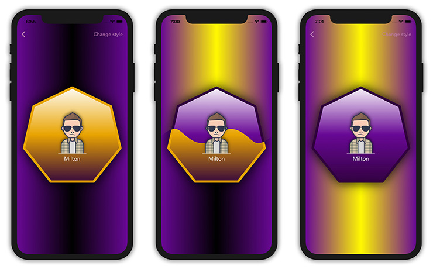
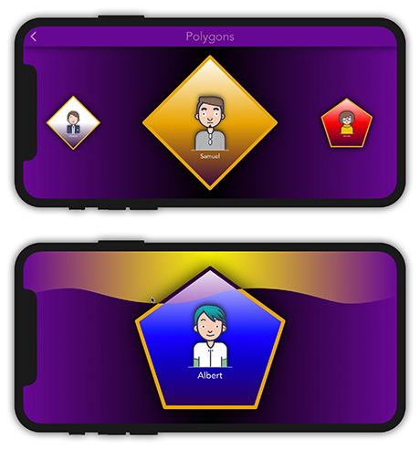

# Zadanie testowe 'Polygons'
Październik 2019  
  

## Treść zadania:
Zadanie polega na stworzeniu aplikacji która, będzie wyświetlać wielokąty foremne. Celem zadania jest pokazanie umiejętności korzystania z UICollectionView z custom FlowLayout, Core Graphics Layers oraz animacji UIKit i Core Animation.  

## Część 1:
- tworzymy generator losowej ilości osób
- każda osoba powinna mieć charakteryzujące ją atrybuty: 
	- numer odpowiadający za kolejność stworzenia
	- inny atrybut, np. imię
- wszystkie utworzone osoby przedstawiamy w tabeli/kolekcji
- każda osoba powinna być przedstawiona za pomocą wielokąta foremnego:
	- indeksy z zakresu 1-5 rysujemy jako trójkąt foremny, kolejne 5 indeksów jako czworokąt itd.
	- mile widziane dodatkowe rozróżnienie grup osób/wielokątów na podstawie indeksu (np. zmiana tła wewnątrz wielokąta)
	- wielokąty powinny być foremne 
	- wielokąty powinny być tworzone własną funkcją, przyjmującą odpowiednie parametry
	- wewnątrz wielokąta należy wyświetlić wszystkie dane charakteryzujące daną osobę
- każdy wielokąt:
	- powinien mieć zaokrąglone narożniki
	- powinien mieć obramowanie o grubości min 5 pkt
	- tło powinno być przedstawione za pomocą gradientu (kolorystykę gradientu należy dobrać tak, aby gradient był wyraźnie widoczny)
	- powinien posiadać również cień

## Część 2 - dodatkowa:
Po kliknięciu w cellkę użytkownik zostanie przeniesiony na osobny widok, gdzie zobaczy powiększony wielokąt z danymi. Przejście między widokami powinno być **customowe - animowane w sposób niestandardowy**.

## Część 3 - dodatkowa:
Za pomocą gestów lub przycisku, przez ekran **przesuwa się *fala* zmieniająca styl / kolorystykę widoku**.

## Specyfikacja:
- tylko natywnie (bez dodatkowych bibliotek)
- projekt winien obsługiwać system od iOS 12
- tylko iPhony
- portrait oraz landscape mode
- projekt powinien być napisany zgodnie z wybraną architekturą wraz z zachowaniem dobrych praktyk tworzenia kodu i projektu

## Opis wykonania:
- zastosowano architekturę MVVM
- w pierwszym widoku zastosowano:
	- tło wypełnione **animowanym gradientem**
	- **customowe buttony** reagujące animacją i dźwiękiem na ich dotknięcie
	- layout dostosowujący się do orientacji urządzenia
- w drugim widoku do wyświetlania wielokątów użyto UICollectionView:
	- FlowLayout zmienia się w zależności od bieżącej orientacji iPhona: dla orientacji pionowej celki rozmieszczane są jedna nad drugą, a dla orientacji poziomej jedna obok drugiej
	- na celki nałożona jest maska w kształcie wielokąta
	- wypełnieniem celki jest tło gradientowe oraz avatar wraz z imieniem osoby
	- płeć osoby jest losowa i na jej podstawie jest dobierana **wektorowa grafika** avatara oraz imię
	- kolejne 5 celek z grupy danego wielokąta mają różne kolory tła
	- podczas przesuwania kontentu listy, widoczne celki są skalowane
	- po zakończeniu przesuwania, celka najbliższa środka ekranu jest do niego przesuwana
	- po wkazaniu celki następuje krótka animacja sygnalizująca, która celka została wybrana, po czym następuje przejście do ekranu detali
- przejście pomiędzy widokiem listy i detali jest zrealizowane jako Custom Presentation Transition
	- wykonan animacja działa również podczas powrotu do widoku listy
- w widoku detali wybrana celka jest rysowana w maksymalnej wielkości, jakie daje dana orientacja
	- po wybraniu gestu przesunięcia palcem w dół lub wybraniu przycisku **Change style** następuje efek zmiany kolorystyki sceny
	- kolejne zastosowanie gestu / buttona przywraca początkowy styl
	- zmiana stylu wykonuje się przez spływającą w dół falę, której aplituda generowana jest losowo